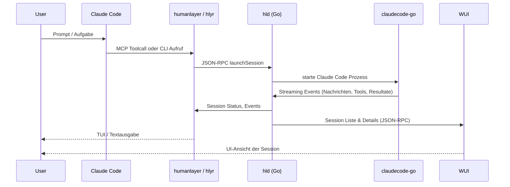
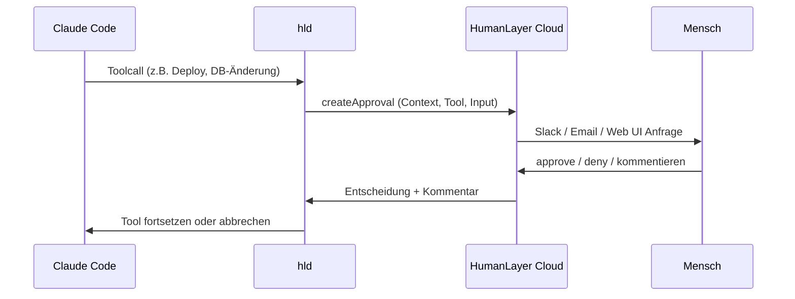

# CodeLayer / HumanLayer – Architekturüberblick

Dieses Dokument fasst die wichtigsten Teile des Monorepos zusammen und zeigt, wie sie im Zusammenspiel eine Human‑in‑the‑Loop‑Umgebung für Claude Code / Coding Agents bilden.

---

## 1. Komponentenübersicht

| Bereich               | Pfad                         | Aufgabe                                                                                           |
|-----------------------|------------------------------|---------------------------------------------------------------------------------------------------|
| Go‑Daemon             | `hld/`                       | Kern‑Daemon: Sessions, Approvals, Events, Storage, JSON‑RPC & REST‑API                           |
| CLI / MCP             | `hlyr/`                      | CLI (`humanlayer`, `codelayer`), MCP‑Server, Thoughts‑Management, Starten des Daemons            |
| Desktop/Web‑UI        | `humanlayer-wui/`            | Tauri + React UI („CodeLayer“) für Sessions & Approvals, spricht über JSON‑RPC mit `hld`         |
| Claude Code Go‑SDK    | `claudecode-go/`             | Go‑Wrapper um Claude Code CLI, wird von `hld` genutzt                                            |
| TS Monorepo – Daemon  | `apps/daemon/`, `packages/contracts/` | ORPC‑basierter TypeScript‑Daemon, der RPC‑Contracts (z.B. `sessions.list`) implementiert  |
| TS Monorepo – DB      | `packages/database/`         | Drizzle + Postgres‑Schema für „Thoughts Documents“, Y.js‑Ops und Scores                          |
| TS Monorepo – React   | `apps/react/`                | Bun‑Server + React‑UI + Electric SQL für kollaborative „Thoughts Documents“                      |
| Docs                  | `docs/`                      | Mintlify‑Doku (Installation, Entwicklung, Case Studies)                                          |
| Repo‑Kontext / Agents | `.claude/`, `CLAUDE.md`      | Konfiguration & Agent‑Prompts für Claude Code in diesem Repo                                     |

---

## 2. High‑Level Datenfluss (Claude Code → HumanLayer)

```mermaid
graph LR
    subgraph IDE
        CC[Claude Code<br/>VS Code / CodeLayer]
    end

    subgraph Local Tools
        HLYR[HumanLayer CLI<br/>hlyr/]
        MCP[MCP Server<br/>hlyr mcp claude_approvals]
        HLD[Daemon hld/<br/>JSON-RPC + REST]
    end

    subgraph HumanLayer Cloud
        HLAPI[HumanLayer API<br/>(Slack, Email, Web)]
    end

    subgraph UI
        WUI[CodeLayer Desktop/Web UI<br/>humanlayer-wui/]
    end

    CC -->|Toolcalls / MCP| MCP
    CC -->|CLI Kommandos| HLYR
    MCP -->|JSON-RPC| HLD
    HLYR -->|JSON-RPC / HTTP| HLD
    HLD -->|Approvals, Contact Human| HLAPI
    HLD <-->|Sessions, Approvals, Events| WUI
```

**Gedankengang:**
- Claude Code spricht über den HumanLayer‑MCP‑Server oder direkt über die CLI mit dem lokalen Daemon.
- Der Go‑Daemon `hld` verwaltet Claude‑Sessions, überwacht Tool‑Calls und fordert bei „High‑Stakes“‑Aktionen eine menschliche Entscheidung an.
- Die Entscheidung kann über CLI/TUI, die CodeLayer‑UI oder über externe Kanäle (Slack, E‑Mail, Web) getroffen werden.

---

## 3. Session‑Lebenszyklus

Beispiel: ein `humanlayer launch ...` oder ein MCP‑Toolcall „starte eine Session“.



**Wesentliche Aufgaben von `hld/`:**
- **Session Management** – Starten, Fortsetzen, Beenden; Status und Metriken (Kosten, Token, Dauer).  
- **Event‑Log** – Speichern der gesamten Konversation (Messages, Tool‑Calls, Tool‑Resultate).  
- **Schnittstellen** – JSON‑RPC über Unix‑Socket (siehe `hld/PROTOCOL.md`) und REST/SSE in `hld/api/`.

---

## 4. Approvals‑Flow (High‑Stakes Function Calls)



**Rollen im Code:**
- **Daemon‑Seite:** `hld/approval/` + `hld/rpc/approval_handlers.go` – Erzeugen und Auflösen von Approvals.  
- **Cloud‑Seite:** externes HumanLayer‑Backend, erreichbar über `@humanlayer/sdk` aus der CLI.  
- **MCP / CLI:** leiten Approvals an UI/TUI weiter und ermöglichen lokale Bestätigung.

---

## 5. Thoughts‑System (Developer Notes)

Das Thoughts‑System hält Entwickler‑Notizen getrennt vom Code, aber eng verzahnt mit der täglichen Arbeit.

```mermaid
graph LR
    subgraph Repo
        Code[Code-Repo]
        Thoughts[thoughts/ (Symlinks + Hardlinks)]
    end

    subgraph ThoughtsRepo
        TRepo[~/thoughts<br/>eigener Git-Repo]
    end

    HCLI[humanlayer thoughts ...]

    Code --> Thoughts
    Thoughts -->|Hardlinks / Symlinks| TRepo
    HCLI -->|init, sync, status| TRepo
    HCLI -->|init, sync, status| Code
```

**Wichtige Punkte (siehe `hlyr/THOUGHTS.md`):**
- `humanlayer thoughts init` richtet ein zentrales Thoughts‑Repo ein und verlinkt es in dein Projekt (`thoughts/`‑Verzeichnis).  
- Git‑Hooks verhindern, dass private Thoughts versehentlich ins Code‑Repo committed werden, und synchronisieren Änderungen ins Thoughts‑Repo.  
- Das Unterverzeichnis `thoughts/searchable/` bietet eine flache, AI‑freundliche Sicht auf alle Notes (Hardlinks, read‑only).

---

## 6. TypeScript‑Monorepo – Kollaborative „Thoughts Documents“

Parallel zum Go‑Daemon gibt es eine experimentelle TS‑Schicht für kollaborative Dokumente.

**Bausteine:**

- **Datenbank‑Layer (`packages/database/`):**  
  - `packages/database/schema/thoughts.ts` definiert Tabellen wie `thoughtsDocuments`, `thoughtsDocumentsOperations`, `ydocAwareness`.  
  - `packages/database/database.ts` stellt eine `db`‑Instanz (Drizzle + Bun‑SQL) bereit.

- **Contracts (`packages/contracts/`):**  
  - `packages/contracts/src/daemon/index.ts` definiert den `daemonRouterContract` inkl. `sessions.list`‑Schema (Zod + @orpc/contract).

- **TS‑Daemon (`apps/daemon/`):**  
  - Baut aus dem Contract mit `@orpc/server` einen RPC‑Server und exportiert einen OpenAPI‑Handler (`apps/daemon/src/index.ts`, `apps/daemon/src/router/*.ts`).  
  - Aktuell primär Stub‑Logik, bereitet künftige Services vor.

- **React + Electric (`apps/react/`):**  
  - Bun‑basierter HTTP‑Server (`apps/react/src/index.tsx`) mit Routen:
    - `/*` → `index.html` / React‑App  
    - `/shape-proxy/*` → Proxy zu Electric SQL Shape‑Server (`apps/react/src/lib/electric-proxy.ts`)  
    - `/v1/thoughts-documents/create` & `/v1/thoughts-document-operations` → REST‑API zum Anlegen von Dokumenten und Speichern von Y.js‑Operationen.  
  - Die UI (`apps/react/src/App.tsx`) zeigt:
    - Liste von Dokumenten (über Electric `useShape`)  
    - Formular zum Anlegen eines Dokuments  
    - Kollaborativen Editor auf Basis Tiptap + Y.js.

**Zielbild:**
- Diese Schicht zeigt, wie „Thoughts“ oder andere Wissensartefakte kollaborativ, realtime‑fähig und strukturiert mit dem restlichen System verzahnt werden können.

---

## 7. Wie das alles zusammenpasst

Zusammengefasst:

- **Claude Code / Agents** liefern die „Intelligenz“ und interagieren über MCP/CLI.  
- **`hld` (Go‑Daemon)** übernimmt Orchestrierung, Persistenz, Approvals und Protokolle.  
- **HumanLayer Cloud** stellt Menschen‑Kontakt und zentrale Services bereit (Slack, Email, Web).  
- **`hlyr` (CLI)** ist dein Eintrittspunkt von der Shell, inklusive MCP‑Server und Thoughts‑Management.  
- **`humanlayer-wui` (CodeLayer)** bietet die vollwertige GUI auf dem lokalen Daemon.  
- **Die TS‑Monorepo‑Schicht** experimentiert mit neuen Services (Contracts, DB‑Layer, kollaborative Dokumente) und kann perspektivisch enger an Daemon und UI angebunden werden.

